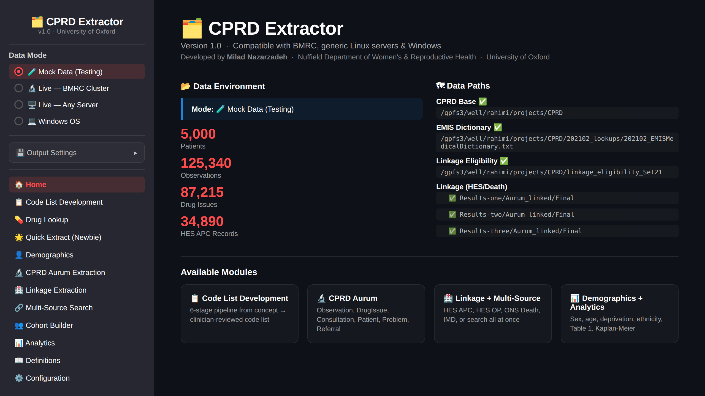
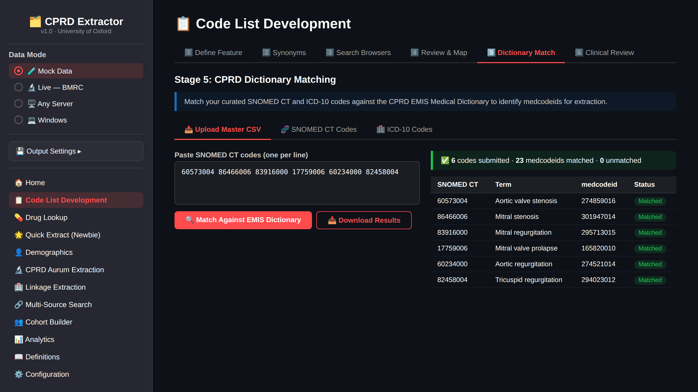
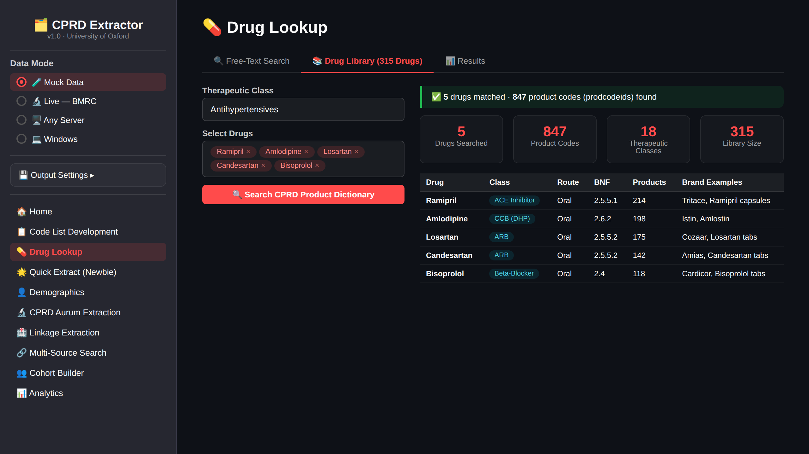
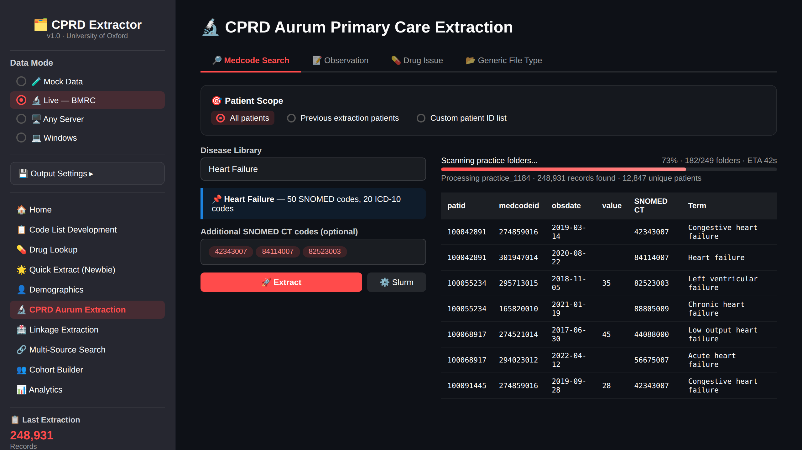
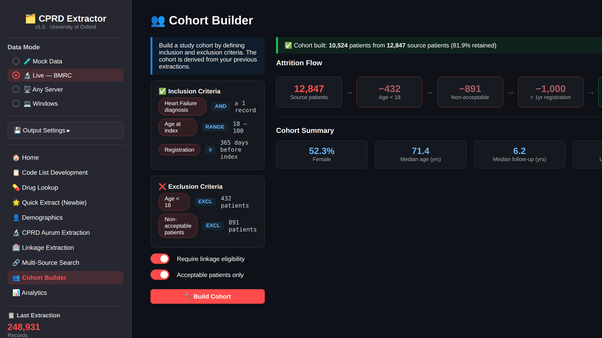

# 🗂️ CPRD Extractor

> An interactive platform for Clinical Practice Research Datalink (CPRD) Aurum data extraction, code list development, and cohort assembly.

**Developed by Dr Milad Nazarzadeh** · Nuffield Department of Women's & Reproductive Health · University of Oxford

---

## Overview

CPRD Extractor is an open-source, browser-based application that provides a complete workflow for researchers working with CPRD Aurum electronic health record data. It unifies clinical code list development, high-performance data extraction, linked dataset querying, and cohort assembly into a single interactive platform.

The tool is designed to run on institutional high-performance computing (HPC) clusters (tested on the Oxford BMRC environment), generic Linux servers, and Windows workstations. It includes a built-in **mock data mode** for testing and demonstration without requiring CPRD data access.

### Key Capabilities

- **Code List Development** — A structured six-stage pipeline for building, validating, and auditing clinical code lists (SNOMED CT, ICD-10, Read, medcodeid).
- **Drug Lookup** — A curated library of 315 cardiovascular and cardiometabolic drugs across 18 therapeutic classes with automated CPRD Product Dictionary matching.
- **Disease Library** — Pre-built SNOMED CT and ICD-10 code sets for 50 cardiovascular conditions.
- **High-Performance Extraction** — DuckDB-powered parallel extraction from CPRD Aurum primary care files (Observation, DrugIssue, Patient, Consultation, Problem, Referral, Staff, Practice).
- **Linked Data Support** — Extraction from HES Admitted Patient Care, HES Outpatient, HES A&E, ONS Mortality, and Index of Multiple Deprivation.
- **Cohort Builder** — Interactive inclusion/exclusion criteria with attrition flowcharts and cross-extraction patient linking.
- **HPC Integration** — Automatic Slurm job array script generation for cluster-scale extraction with one-command launch.

---

## Screenshots

### Home Dashboard

The home screen provides an overview of the data environment, configured paths, and available modules.



### Code List Development

A six-stage pipeline guides the user from defining a clinical feature of interest, through synonym generation and code browser searches, to CPRD EMIS Dictionary matching with full audit trail and Excel export.



### Drug Lookup

Search and browse 315 cardiovascular/cardiometabolic drugs by therapeutic class, generic name, or brand name. Matched product codes (prodcodeids) are returned for direct use in CPRD DrugIssue extraction.



### CPRD Aurum Extraction

Configure and launch high-performance extraction jobs across CPRD Aurum tables using a parallel DuckDB engine. Supports both local and HPC (Slurm) modes.



### Cohort Builder

Define inclusion/exclusion criteria interactively and generate attrition flowcharts. Link patients across multiple extractions and export final cohort files.



---

## Installation

### Prerequisites

- Python 3.9+
- pip

### Setup

```bash
# Clone the repository
git clone https://github.com/miladnazarzadeh/CprdExtractor.git
cd CprdExtractor

# Install dependencies
pip install -r requirements.txt

# Launch the application
streamlit run app.py
```

---

## Modules

| Module | Description |
|--------|-------------|
| Home Dashboard | Environment overview and path configuration |
| Code List Development | 6-stage clinical code list pipeline |
| Drug Lookup | 315 cardiovascular/cardiometabolic drugs |
| Quick Extract | Simplified extraction for new users |
| Demographics | Patient demographic extraction |
| CPRD Aurum Extraction | Full primary care data extraction |
| Linkage Extraction | HES APC/OP/AE, ONS Death, IMD |
| Multi-Source Search | Cross-database code searching |
| Cohort Builder | Inclusion/exclusion and attrition |
| Analytics | Built-in data visualisation |
| Definitions | Clinical terminology reference |
| Configuration | Path and environment setup |

---

## Citation

If you use CPRD Extractor in your research, please cite it using the GitHub citation button (top right of repository page) or:

```bibtex
@software{Nazarzadeh_CprdExtractor,
  author = {Nazarzadeh, Milad},
  title = {CprdExtractor},
  url = {https://github.com/miladnazarzadeh/CprdExtractor},
  version = {1.0.0}
}
```

---

## Contributing

Contributions are welcome. Please read [CONTRIBUTING.md](CONTRIBUTING.md) for guidelines.

---

## License

This project is licensed under the MIT License.

---

## Acknowledgements

Developed as part of the HEART-MIND Programme, Nuffield Department of Women's & Reproductive Health, University of Oxford.
